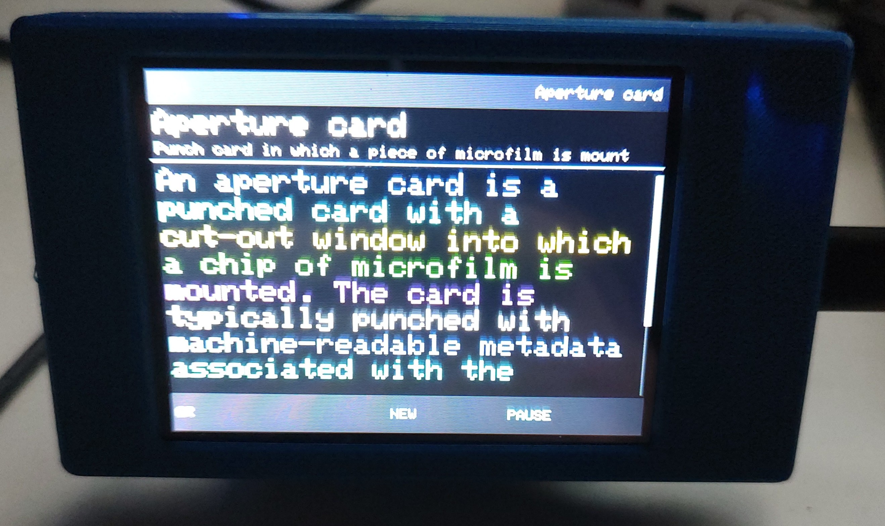
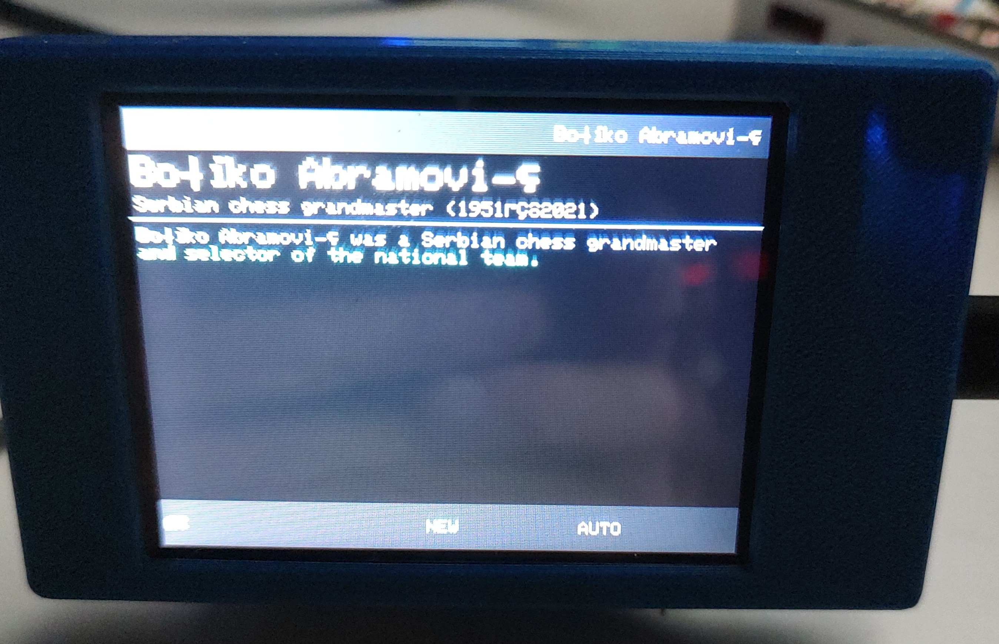
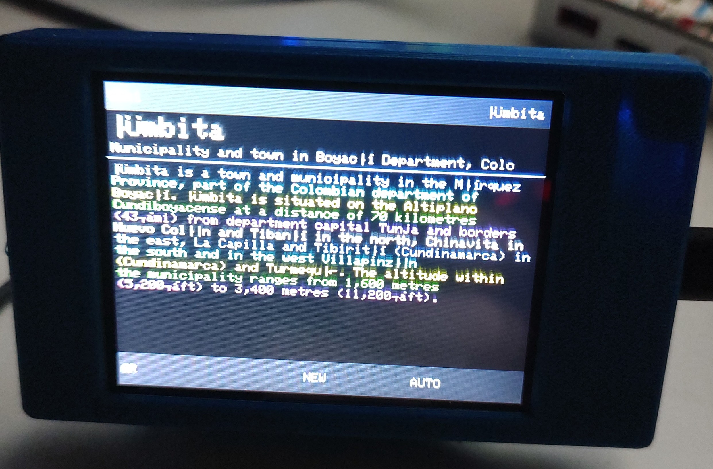

# 📖 WikiCYD

**Random Wikipedia articles on the CYD (Cheap Yellow Display)**

WikiCYD turns a $5 ESP32 touchscreen into a always-on desktop Wikipedia browser. Every time you power it on — or tap **NEW** — it fetches a completely random Wikipedia article straight from the live API and displays the title, description, and a scrollable extract right on the screen. It's the kind of thing you leave on your desk and glance at throughout the day, learning something new every time.

---

## Photos

| Article view | Short article | Full extract |
|---|---|---|
|  |  |  |

---

## Features

- 🌐 **Live Wikipedia API** — fetches real random articles via HTTPS on every request
- 📜 **Scrollable extract** — tap the top half of the screen to scroll up, bottom half to scroll down
- 📱 **QR code mode** — tap **QR** in the footer to display a scannable QR code linking to the full Wikipedia article on your phone
- 🔄 **Auto-fetch** — tap **AUTO** to automatically cycle to a new article on a configurable interval (5 min / 30 min / 1 hour)
- 🎨 **Color themes** — choose from Blue, Orange, Green, Cyan, White, or Multicolor (each line a different color) via the setup portal
- 🔤 **Font size** — Small, Medium, or Large text selectable at setup
- ⚙️ **Captive portal setup** — on first boot, the device creates a WiFi access point (`WikiCYD_Setup`). Connect from any phone or browser, enter your WiFi credentials and preferences, and it saves everything to flash
- 🔁 **BOOT button shortcuts** — short press = new article immediately, long press (2s+) = re-enter setup

---

## Hardware

- **ESP32 "CYD"** (Cheap Yellow Display) — ESP32 with built-in ILI9341 320×240 TFT and XPT2046 resistive touchscreen
- Any standard CYD variant will work; see `INVERTEDWikiCYD/` if your display has inverted colors

---

## Getting Started

### 1. Flash with PlatformIO

```bash
# Clone the repo
git clone https://github.com/yourusername/WikiCYD.git
cd WikiCYD

# Build and upload
pio run --target upload

# Monitor serial output
pio device monitor
```

### 2. First Boot — Setup Portal

1. The CYD will broadcast a WiFi network: **`WikiCYD_Setup`**
2. Connect to it from your phone or laptop (no password)
3. Open **`192.168.4.1`** in a browser
4. Enter your 2.4 GHz WiFi credentials, pick a color theme and font size, tap **Save & Connect**
5. The device restarts, connects to WiFi, and immediately fetches the first article

### 3. Using It

| Touch Zone | Action |
|---|---|
| Footer — left third (**QR**) | Show QR code for the current article |
| Footer — middle third (**NEW**) | Fetch a new random article |
| Footer — right third (**AUTO/PAUSE**) | Toggle auto-fetch on/off |
| Body — top half | Scroll extract up |
| Body — bottom half | Scroll extract down |
| Anywhere (QR mode) | Return to article view |
| BOOT short press | New random article |
| BOOT long press (2s+) | Re-enter WiFi/settings setup |

---

## Inverted Display Variant

Some CYD boards have inverted display hardware and show washed-out colors with the default firmware. Use the `INVERTEDWikiCYD/` folder — it is identical except for a single `gfx->invertDisplay(true)` call that corrects the colors.

```
WikiCYD/
├── src/main.cpp          ← Standard display
├── include/
│   ├── Wikipedia.h       ← HTTPS fetch + JSON parsing
│   └── Portal.h          ← Captive portal + settings
├── platformio.ini
└── INVERTEDWikiCYD/      ← For CYDs with inverted hardware
    ├── src/main.cpp
    ├── include/
    └── platformio.ini
```

---

## Dependencies

Managed automatically by PlatformIO:

| Library | Purpose |
|---|---|
| `moononournation/GFX Library for Arduino` | ILI9341 display driver |
| `PaulStoffregen/XPT2046_Touchscreen` | Resistive touch input |
| `bblanchon/ArduinoJson` | Wikipedia API JSON parsing |
| `ricmoo/QRCode` | QR code generation |

---

## How It Works

WikiCYD calls Wikipedia's `/api/rest_v1/page/random/summary` endpoint over HTTPS. The API returns an HTTP 303 redirect to the actual article path. The firmware follows the redirect manually (two sequential TLS connections) to avoid recursion, parses the JSON for title, description, extract, and desktop URL, then renders everything locally — no external services, no cloud dependency beyond Wikipedia itself.

---

## License

MIT
